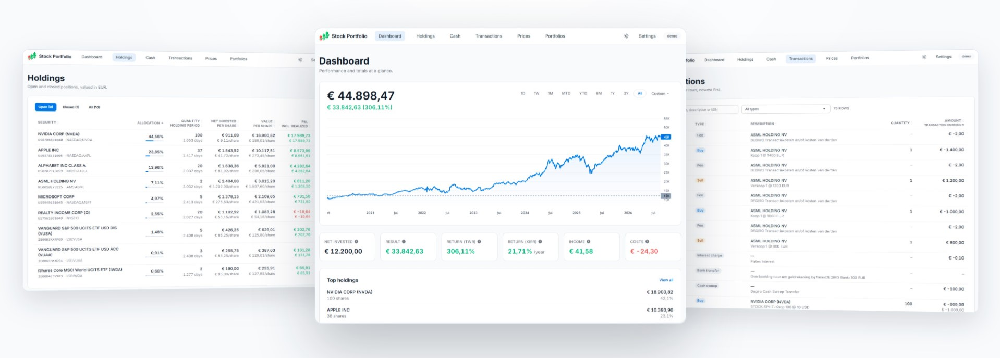

# StockPortfolioApp

A client-side Angular application for tracking an investment portfolio from DEGIRO CSV exports.

<p align="center">
  
</p>

## Features

- Import and reconcile DEGIRO transactions
    - The parser currently supports Dutch language DEGIRO exports only
- Holdings, per-holding lot details, cash, transactions, valuation, return, and market-value history
- Configurable FIFO/LIFO lot consumption with realized P&L per sale
- Simple and money-weighted return views
- Multiple portfolios
- Local JSON backup and restore
- Light and dark mode
- Optional live quotes and historical prices through the local market-data proxy
- Optional benchmark comparison on the dashboard chart (per portfolio): a shadow line in your portfolio currency invests your money in the benchmark with the same timing as your real deposits, and a % view compares indexed performance from the range start

Portfolio data is stored in the browser's IndexedDB. The application has no backend and does not upload imported portfolio data to this repository or to an application server.

## Requirements

- Node.js 24 or newer
    - with npm 11 or newer

## Development

```bash
npm ci
npm start
```

`npm start` opens `http://localhost:4200/` automatically in your browser by calling `ng serve -o`.

A synthetic DEGIRO import file is available at [examples/demo/degiro-demo.csv](examples/demo/degiro-demo.csv). It contains fictional transactions from January 2020 through January 2026 for well-known large-cap stocks and ETFs, including staged ASML sales and repurchases that make the offline valuation trend visible. When re-importing an updated demo file, use a fresh portfolio because imports are incremental.
The published [GitHub Pages demo](https://jeffreyhaen.github.io/stock-portfolio-tracker) automatically loads this file into a `Demo` portfolio for new visitors. Local development and other deployments do not load demo data. Existing browser data is left untouched, and deleting the automatically created `Demo` portfolio does not cause it to return on a later visit.

Start both the portfolio app and the market-data proxy together:

```bash
npm start
```

To start only the portfolio app:

```bash
npm run app
```

To start only the market-data proxy:

```bash
npm run market-data-proxy
```

The market-data proxy is experimental and intended for local development only. It listens on `http://localhost:8787` by default, and retrieves quote data from Yahoo Finance through unofficial endpoints. Do not deploy or expose it to the public internet. Foreign-exchange (FX) rates are retrieved from Frankfurter. Review the terms and availability of these external services before relying on the data.

## Verification

```bash
npm test
npm run lint
npm run build
```

## Static hosting with GitHub Pages

The app can be hosted as static files. The GitHub Pages workflow builds with the repository subpath as Angular's base href and adds a `404.html` SPA fallback so bookmarked portfolio routes return to the Angular router. Enable GitHub Pages with **GitHub Actions** as its source. A custom domain or root-path deployment must build with its own `--base-href` instead.

Live quote search and refresh remain optional. The bundled provider is enabled only when the app itself runs on localhost and expects the local proxy at `http://localhost:8787`. Visitors to the published [GitHub Pages demo](https://jeffreyhaen.github.io/stock-portfolio-tracker) automatically start with the synthetic demo portfolio. Visitors can import, select portfolios, use transaction-price estimates, and enter manual prices without background requests to that proxy. Browser IndexedDB data is scoped to the hosted origin.

## Privacy and limitations

- Imported CSV files and exported backups can contain sensitive financial information. Keep them local and do not commit them.
- This application is a portfolio tracking tool, not financial advice.
- Quote and foreign-exchange data may be delayed, incomplete, or unavailable.
- The market-data proxy is experimental and intended for local development only. It uses unofficial Yahoo Finance endpoints; do not expose it to the public internet or use it as a public/commercial data service without confirming the applicable provider terms and adding suitable authentication, rate limiting, and operational controls.

## License

Licensed under the Apache License, Version 2.0. See [LICENSE](LICENSE).
